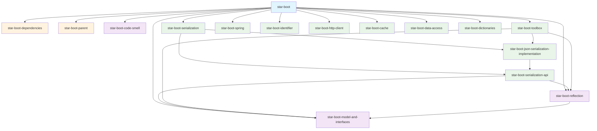
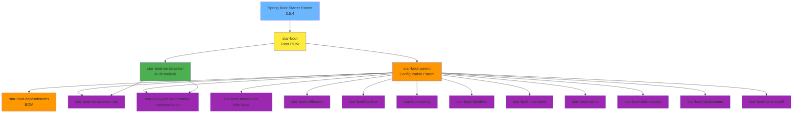

# Star Boot Framework

Набор библиотек для работы с Java проектами, построенный на основе Spring Boot.

## 🏗️ Архитектура проекта

### Диаграмма зависимостей модулей

### Иерархия наследования Maven

## 📦 Описание модулей

### Управляющие модули

| Модуль | Тип | Описание |
|--------|-----|----------|
| **star-boot** | `pom` | Корневой модуль проекта, определяет общую структуру и включает все подмодули |
| **star-boot-parent** | `pom` | Родительский POM с конфигурацией плагинов, свойств и управления зависимостями |
| **star-boot-dependencies** | `pom` | BOM (Bill of Materials) для управления версиями зависимостей |

### Базовые модули

| Модуль | Тип | Описание |
|--------|-----|----------|
| **star-boot-model-and-interfaces** | `jar` | Базовые модели данных, интерфейсы и контракты системы |
| **star-boot-reflection** | `jar` | Утилиты для работы с рефлексией Java, анализ классов и методов |
| **star-boot-code-smell** | `jar` | Инструменты статического анализа кода и обнаружения "code smells" |

### Модули сериализации

| Модуль | Тип | Описание |
|--------|-----|----------|
| **star-boot-serialization** | `pom` | Группирующий модуль для компонентов сериализации |
| **star-boot-serialization-api** | `jar` | API для сериализации объектов, абстракции и интерфейсы |
| **star-boot-json-serialization-implementation** | `jar` | Реализация JSON сериализации на основе Jackson |

### Прикладные модули

| Модуль | Тип | Описание |
|--------|-----|----------|
| **star-boot-toolbox** | `jar` | Набор утилит для работы с файлами (Excel, CSV), HTML парсинг (JSoup) |
| **star-boot-spring** | `jar` | Интеграция со Spring Framework, автоконфигурация, Spring-специфичные компоненты |
| **star-boot-identifier** | `jar` | Генерация и работа с уникальными идентификаторами |
| **star-boot-http-client** | `jar` | HTTP клиент с поддержкой различных протоколов и форматов |
| **star-boot-cache** | `jar` | Система кеширования с поддержкой различных провайдеров |
| **star-boot-data-access** | `jar` | Абстракции для работы с базами данных, поддержка JOOQ и Liquibase |
| **star-boot-dictionaries** | `jar` | Система справочников и классификаторов |

## 🔧 Технологический стек

- **Java**: 24
- **Spring Boot**: 3.5.4
- **Jakarta EE**: с jakarta imports
- **Lombok**: Для генерации boilerplate кода
- **Maven**: Система сборки
- **JOOQ**: Type-safe SQL builder
- **Liquibase**: Database migration
- **Apache POI**: Работа с Excel файлами
- **JSoup**: HTML парсинг
- **OpenCSV**: CSV обработка
- **JUnit 5**: Тестирование
- **Testcontainers**: Integration тестирование

## 📊 Зависимости между модулями

### Прямые зависимости

- `star-boot-reflection` зависит от:
  - `star-boot-model-and-interfaces`

- `star-boot-serialization-api` зависит от:
  - `star-boot-model-and-interfaces`
  - `star-boot-reflection`

- `star-boot-json-serialization-implementation` зависит от:
  - `star-boot-serialization-api` (транзитивно получает остальные)
  - `star-boot-reflection`

- `star-boot-toolbox` зависит от:
  - `star-boot-model-and-interfaces`
  - `star-boot-reflection`
  - `star-boot-json-serialization-implementation`

### Внешние библиотеки

Проект использует контролируемые версии внешних зависимостей через `star-boot-dependencies` BOM:
- Apache POI (Excel)
- JSoup (HTML parsing)
- OpenCSV (CSV processing)
- PostgreSQL driver
- Testcontainers

## 🚀 Начало работы

1. Убедитесь, что у вас установлена Java 24+
2. Клонируйте репозиторий
3. Выполните сборку: `./mvnw clean install`

## 📈 Качество кода

Проект включает:
- **Checkstyle** - статический анализ стиля кода
- **JaCoCo** - анализ покрытия тестами (минимум 80% для строк, 75% для веток)
- **Allure** - детальная отчетность по тестам
- **Maven Enforcer** - контроль качества зависимостей и конфигурации

## 📝 Лицензия

Apache License 2.0 - подробности в файле LICENSE

### Maven Parent overrides

Due to Maven's design, elements are inherited from the parent POM to the project POM.
While most of the inheritance is fine, it also inherits unwanted elements like `<license>` and `<developers>` from the
parent.
To prevent this, the project POM contains empty overrides for these elements.
If you manually switch to a different parent and actually want the inheritance, you need to remove those overrides.

